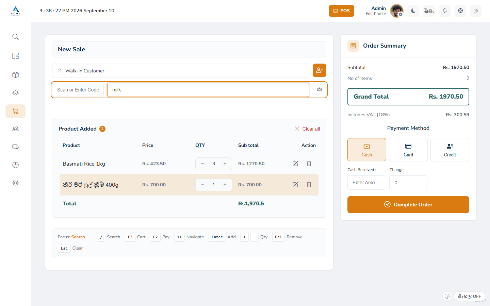
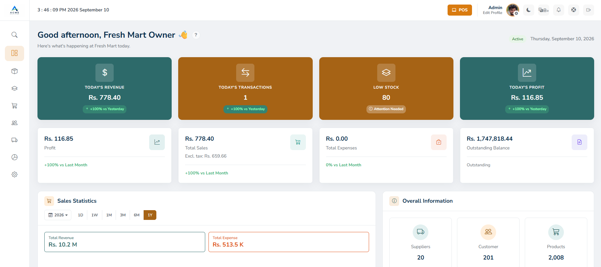
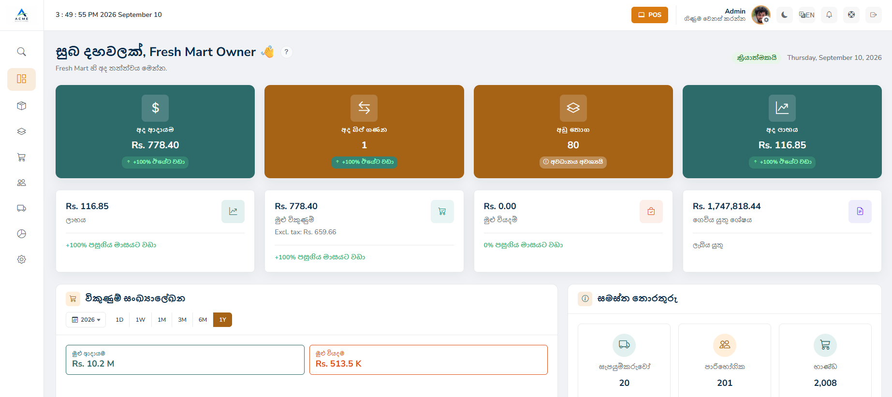
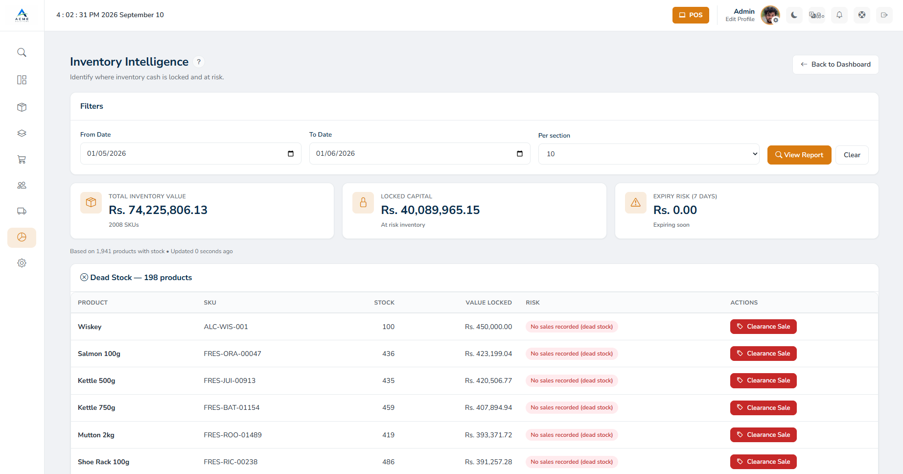
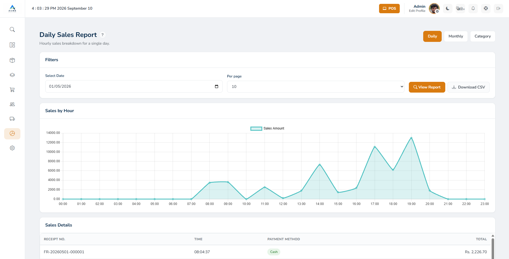
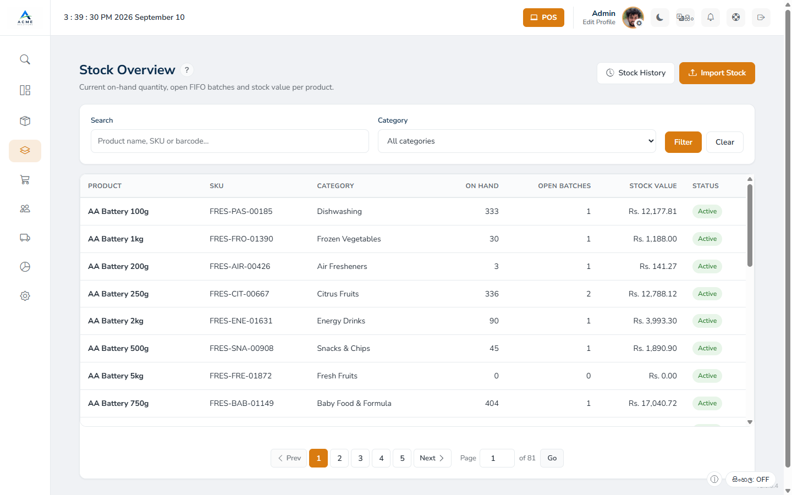
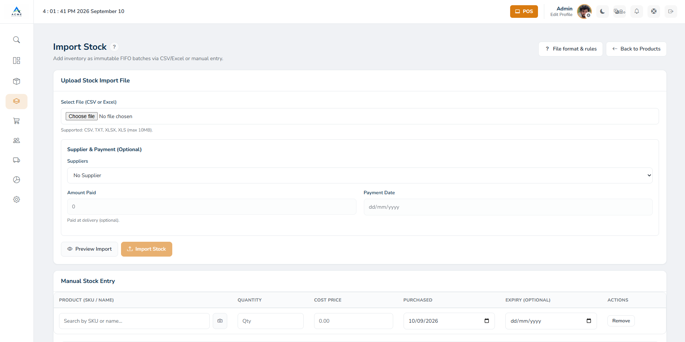
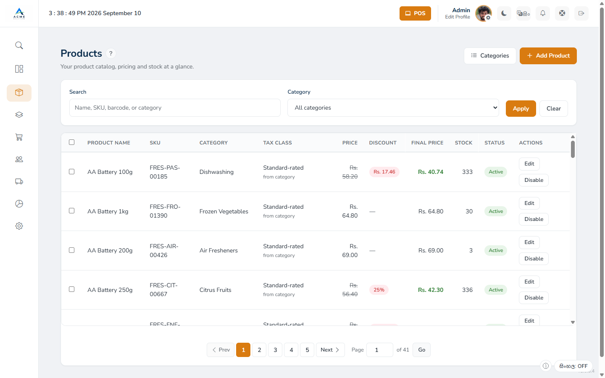
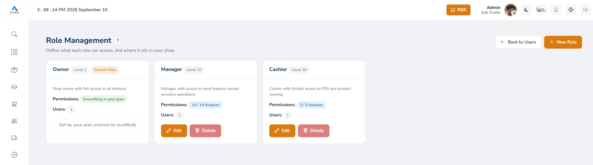
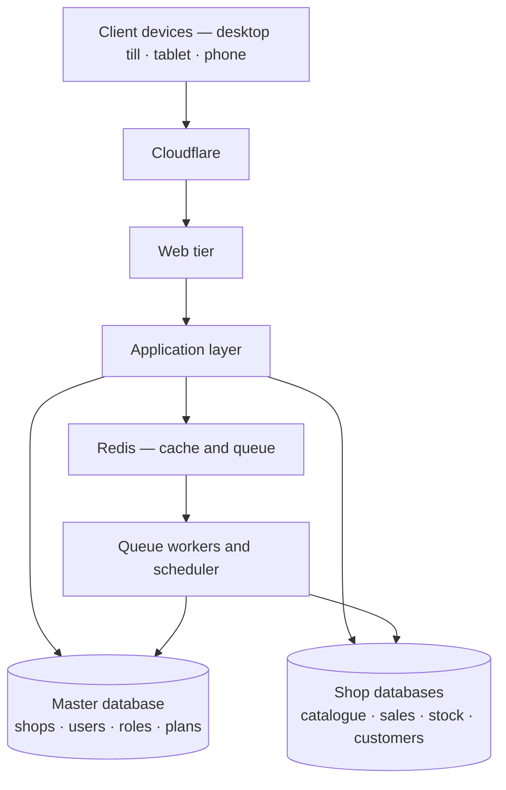

# Awaken POS

A multi-tenant, cloud-hosted point-of-sale and retail management system for small and mid-sized
retail shops in Sri Lanka — architected, built, tested and deployed by me as the sole developer.
It handles a shop's full operational day: selling at the till, costed stock, credit customers,
suppliers, tax and reporting.

**Live product → [pos.awakendev.com](https://pos.awakendev.com)**

> **This is a portfolio and documentation repository.** The production application is
> closed-source; no source code, database schema or infrastructure configuration is published here.

---

## Screenshots

**Point of sale** — a retail checkout screen with product search, discounts, tax and multiple payment options.

| Dashboard | Sinhala interface |
|---|---|
|  |  |

| Inventory intelligence — where cash is locked | Daily sales, hour by hour |
|---|---|
|  |  |

| Stock overview with FIFO batches | Stock intake by file or manual entry |
|---|---|
|  |  |

| Product catalogue | Roles and permissions |
|---|---|
|  |  |

*Captured from a demonstration shop populated with generated data. More in
[docs/screenshots/](docs/screenshots/).*

---

## Overview

Most small retailers here run on paper, spreadsheets, or offline software locked to one machine,
and the alternatives are priced for businesses many times their size. Awaken POS is a browser-based
system a shop opens on a desktop till, a tablet or a phone.

**Who it is for:** independent shops and small chains — an owner plus a handful of staff, often on
modest hardware and mobile connections.

**Built for its market:** LKR throughout, an English/Sinhala interface, search that matches Sinhala
and transliterated product names, and receipts sized for the thermal printers shops here buy.

---

## Key Features

**Selling** — till with live product search; barcode scanning by hardware scanner, device camera or
manual entry; discounts and recorded price overrides; cash and credit payment; sequential per-shop
receipt numbering; duplicate-submission protection; void with separate authorisation; quotations.

**Stock** — costed batches with purchase and expiry dates, consumed oldest-first; CSV and manual
intake recorded as auditable imports; adjustments, history, low-stock and expiry reporting.

**Money** — customer credit and payment allocation; supplier payables; tax classification with
inheritance; eleven reports across sales, cost, profit, stock valuation and tax; CSV exports.

**Control** — shop-defined roles with a seniority ordering; per-feature permissions enforced in the
request pipeline; append-only sales with void as the only correction; activity and admin audit logs.

**Platform** — subscription plans gating features and staff seats, trials and renewals, PDF
invoices, and an operator administration area.

→ Full breakdown, including partial and planned work: **[docs/features.md](docs/features.md)**

---

## Architecture

Multi-tenancy is enforced at the database boundary rather than by filtering every query.
Platform-wide records live in a master database; each shop's operational data lives in its own shop
database, and a request binds to the correct one for its lifetime. Because a query cannot join
across that boundary, one shop reading another's data is a design-time impossibility rather than a
runtime risk that depends on remembering a filter.

A layered pipeline establishes identity, account status, shop membership, database binding,
subscription validity, per-feature permission and locale before a controller runs. Controllers stay
thin; work touching money or stock lives in dedicated, individually testable services.

→ **[docs/architecture.md](docs/architecture.md)**

---

## Technology Stack

| Layer | Technology |
|---|---|
| Language & framework | PHP 8.2, Laravel 12 |
| Frontend | Server-rendered Blade, vanilla JavaScript, token-based CSS system |
| Build | Vite |
| Database | MariaDB 11, split into master and per-shop databases |
| Cache & queue | Redis |
| Web tier | nginx, PHP-FPM, opcache |
| Containers | Docker, Docker Compose, multi-stage builds |
| Testing | PHPUnit, Mockery, Faker |
| Code style | Laravel Pint, enforced in CI |
| Auth | Session auth, Google OAuth, email OTP MFA for administrators |
| Barcode | WebAssembly camera decoding, hardware scanner, manual entry |
| CI/CD | GitHub Actions |

**No SPA framework, deliberately.** Target users are on modest hardware and mobile data; a
server-rendered app with targeted JavaScript loads faster there and removes a category of
client-state bugs from screens that handle money.

---

## Engineering Highlights

- **Idempotent checkout** — a retried or double-tapped sale resolves to the transaction that already
  committed, including when two requests race and the database constraint settles it.
- **Concurrency-safe receipt numbering** — numbers must be unique *and* gapless, since a missing one
  is indistinguishable from a deleted sale. Atomic allocation bound to the sale's transaction,
  verified under simulated multi-till load.
- **Oversell prevention** — stock drawn down under row-level locking inside the sale transaction.
- **FIFO cost basis** — each sale line records the cost of the batch it consumed, which makes profit
  reporting real rather than estimated.
- **Consistent lock ordering** — one documented ordering across every path writing both stock and
  product records, with a build check that fails if new code reverses it.
- **Time-zone-aware reporting** — the app runs in UTC while shops trade elsewhere; periods cut at
  the shop's day boundary, handled centrally and guarded automatically.
- **Centralised money arithmetic** — rounding in one helper, with a build check preventing
  hand-rolled copies.
- **Sinhala and Singlish search** — must match part-way into a name, which rules out full-text
  indexing; documented so it is not later "optimised" into breaking the till.
- **Architectural guardrail tests** — checks that scan the codebase and fail the build when a design
  rule is violated, so decisions survive future changes.

→ **[docs/engineering.md](docs/engineering.md)**

---

## Testing

PHPUnit, run in the same container image as the application against dedicated test databases, with
layered guards making it structurally difficult for a test run to reach real data.

Most recent full run: **1,638 tests, 9,635 assertions, passing**, across 268 test files — covering
financial correctness, security and access control, shop-facing behaviour, and convention tests
enforcing build-time rules.

No line-coverage figure is claimed, because none is measured. Two practices worth naming:
**mutation checking**, deliberately breaking money and access-control code to confirm the test
fails, since a passing test proves nothing until shown capable of failing; and **load testing**
under simulated concurrent tills, which surfaced a concurrency defect single-threaded tests could
not have found.

→ **[docs/testing.md](docs/testing.md)**

---

## Deployment

Containerised on a Linux VPS behind Cloudflare, with web tier, application, scheduler and queue
workers as separate services. Staging and production are isolated, and every change is verified on
staging first. CI runs code style, a dependency security audit, migrations and the full suite on
every push. Deployment ends in a health check and a transactional smoke test, so a green deploy
means more than "the container started". Scheduled health checks, external monitoring independent
of the application host, and integrity-verified backups with a rehearsed restore procedure.

Infrastructure identifiers, hostnames and configuration are deliberately not published.

→ **[docs/deployment.md](docs/deployment.md)**

---

## Current Status

**The product is live and currently being trialled by a real business. It is actively maintained
and developed**, alongside a separate staging environment used to verify every change before
release.

It is built for a deliberately modest initial scale, with a data architecture that allows growth
without re-architecting. Known issues and planned improvements are tracked internally as part of
ongoing development.

---

## My Role

I am the sole developer of Awaken POS. Working independently, I handled the architecture,
implementation, testing, debugging, third-party integrations, and deployment and operations.

I use AI coding tools extensively as part of my development workflow, while personally making the
architectural decisions, reviewing the output, testing it and taking responsibility for what ships.

I am an early-career developer — I have not worked on a team of engineers or operated at large
scale. What I have done is take a real business problem from nothing to a deployed system a
business relies on, and keep developing it: learning first-hand what breaks under concurrent load,
what an unverified backup is worth, and why a test suite can pass for the wrong reason.

---

## Why I Built It

The shops I know were running on paper and spreadsheets, and an owner who wants last month's actual
profit should not have to reconstruct it by hand. I wanted to prove to myself I could build the
whole thing — not a demo, but a system that takes money, holds a business's records and has to be
right every time. That meant learning what a tutorial does not cover: that a race condition
presents as a flaky till, that a backup nobody has restored is a guess, and that the hard part of a
feature is usually the case you did not think of.

---

## Contact

**Nishal Dilanga Ranasinghe** — [github.com/NDsasuke](https://github.com/NDsasuke)

Open to software engineering roles and freelance work. Happy to walk through the architecture, the
engineering decisions, or a live demo.

---

*Documentation only. Awaken POS is proprietary and its source code is not published.*
