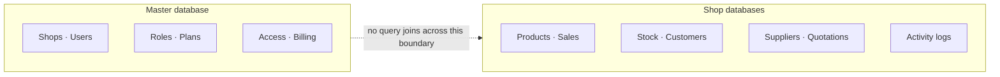

# Architecture

A conceptual overview of how Awaken POS is put together, and why. This describes design decisions
and their reasoning; it deliberately omits schema, configuration, infrastructure identifiers and
implementation detail.

---

## The central decision: tenancy at the database boundary

Awaken POS is multi-tenant — many independent shops on one deployment. The usual approach is a
shared database with a tenant column on every table, filtered on every query. That works until the
day somebody forgets the filter, and the failure mode is one business seeing another's sales.

This system separates tenancy at the database boundary instead.

- **Master** holds what is shared across the platform: shop records, user accounts, roles,
  subscription plans and billing.
- **Shop databases** hold operational data: catalogue, sales, stock, customers, suppliers and
  audit trails.

Each request resolves the calling shop to its database and binds that connection for the lifetime
of the request. Queries that touch shop data name their connection explicitly rather than relying
on whatever the ambient default happens to be — which matters most inside transactions, where a
lock taken on the wrong connection is not the lock you think you are holding.

**What this buys.** Cross-tenant data access is not something a developer has to remember to
prevent; it is structurally unavailable, because the join cannot be written. Capacity is added by
adding shop databases rather than by growing one table forever, and shops can be distributed
without redistributing the ones already placed.

**What it costs.** No foreign keys across the boundary, and no joins between a shop's data and
platform data. Anything needing both — naming the cashier on a sale, for example — is an explicit
two-step lookup. Schema changes must be applied to every shop database, not just one. These are
real constraints, and accepting them was the trade: the cost is paid at development time, in code
that has to be written deliberately, rather than at runtime as a class of bug that is invisible
until it is catastrophic.

---

## Request pipeline

Authorisation is enforced in the request pipeline, not in the view layer. A layered chain
establishes, in order:

1. **Identity** — is this an authenticated session?
2. **Account status** — is the account still active? Deactivation takes effect on the next
   request, not at the next login.
3. **Shop membership** — does this user belong to the shop being addressed?
4. **Database binding** — bind the correct shop database for this request.
5. **Subscription** — is the shop's subscription valid, and does its plan include this area?
6. **Permission** — does this user's role grant this specific feature?
7. **Locale** — resolve the interface language.
8. **Response headers** — apply the security header set.

The important consequence is that hiding a link in the navigation is not what protects a screen.
A route cannot be reached by typing its address just because the menu does not show it, because
the check runs before the controller does.

---

## Application layering

Controllers are kept thin. The work that matters — anything touching money, stock or access — is
factored into named service classes with a single responsibility each: stock allocation, cart
pricing, receipt allocation, total reconciliation, void authorisation, payment allocation, stock
intake.

This is not layering for its own sake. Each of those has rules that are easy to state and easy to
break, and each is separately testable in isolation. Every one carries documentation of the rules
it enforces and the ways it can fail, because the next person to change it — including me, months
later — needs to know what was deliberate.

---

## Background processing

Redis backs both caching and the job queue. Work runs in the background when it would otherwise
make a user wait:

- report computation over large date ranges
- CSV export generation
- PDF document generation
- transactional email

A scheduler service runs recurring work: backups, subscription expiry and renewal reminders,
health checks, and data retention pruning.

A dead queue worker or a dead scheduler is a silent failure — everything looks fine, and work
simply stops happening. Both therefore emit heartbeats, and a periodic canary job proves the queue
is not merely accepting work but actually executing it.

---

## Caching

Caching is applied where measurement showed it was needed, not by default. The main uses are
product catalogue and search projections for the till, dashboard aggregates, and computed report
results. Cache invalidation is driven by the events that make data stale — a sale, a stock
movement, a catalogue edit — rather than by short expiry times, so the till never shows a figure
that is merely recent.

---

## Data integrity model

Three principles run through the financial parts of the system.

**Completed sales are append-only.** No route edits or deletes a completed sale. The only
permitted correction is a void, which is itself a recorded event with its own authorisation, and
which returns stock through the same accounting path it was consumed by.

**Recorded figures are frozen; displayed figures are live.** A sale stores its own tax and cost
figures at the moment of sale. Changing a tax rate or a product price tomorrow does not alter what
last month's receipts say. Estimates that are legitimately live — a quotation, a cart in progress
— are labelled as such.

**Discrepancies are recorded, not silently corrected.** Automated stock consistency checking
writes what it finds rather than quietly adjusting the numbers, because a system that repairs its
own books without telling anyone destroys the evidence of whatever caused the problem.

---

## Auditing

Two separate trails, for two separate audiences.

- A **shop activity log** records events the shop itself may need to answer for: price overrides
  at the till, stock movements and adjustments, voids, and access changes — with the identity of
  the person responsible.
- An **administrative audit log** records platform-operator actions, separately, so an operator
  cannot be confused with a shopkeeper in either direction.

Retention differs by record type. Logs get a retention window; business records do not. The
distinction is whose data it is: a shop's evidence of who overrode a price is kept far longer than
an operational diagnostic table nothing reads.

---

## Deployment shape

The application runs as separate containerised services — web tier, application, scheduler and
queue workers — against separate database services and a cache. Staging and production are fully
isolated environments.

Further detail, at a deliberately high level, is in [deployment.md](deployment.md).
